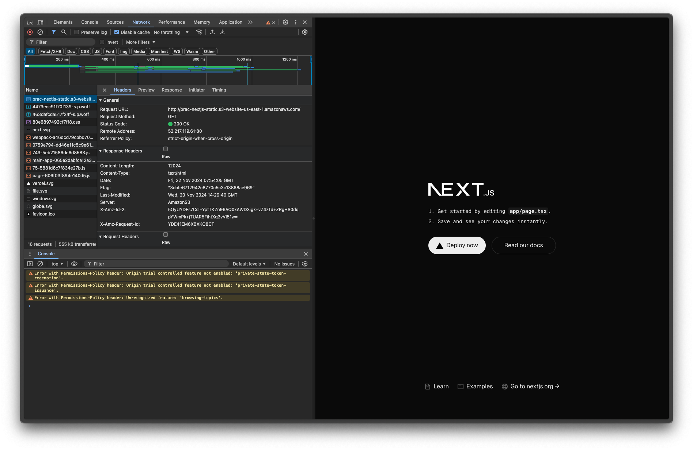
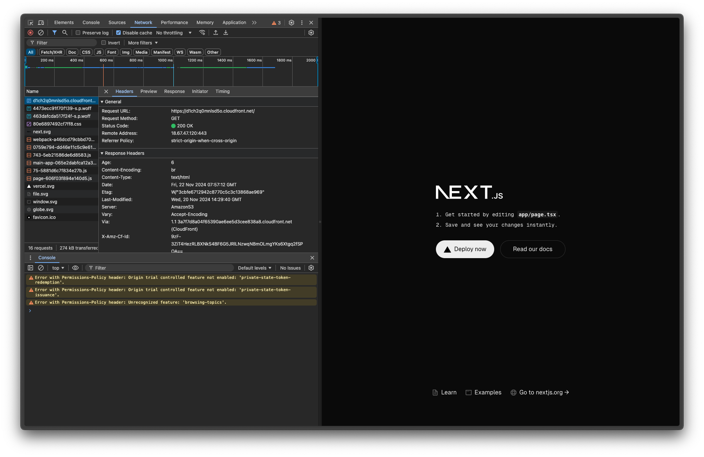
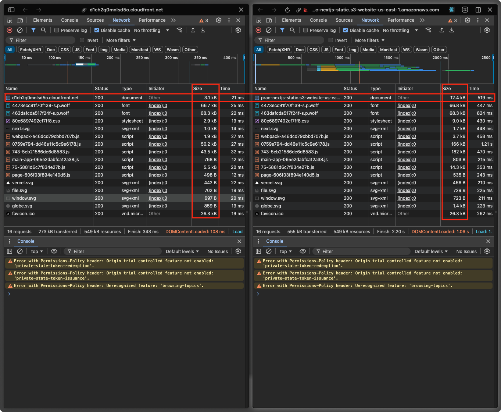

This is a [Next.js](https://nextjs.org) project bootstrapped with [`create-next-app`](https://nextjs.org/docs/app/api-reference/cli/create-next-app).

# 목차

- [목차](#목차)
  - [Getting Started](#getting-started)
  - [Learn More](#learn-more)
  - [프론트엔드 배포 파이프라인](#프론트엔드-배포-파이프라인)
    - [개요](#개요)
    - [주요 링크](#주요-링크)
    - [주요 개념](#주요-개념)
    - [CDN과 성능 최적화](#cdn과-성능-최적화)

## Getting Started

First, run the development server:

```bash
pnpm dev
```

Open [http://localhost:3000](http://localhost:3000) with your browser to see the result.

You can start editing the page by modifying `app/page.tsx`. The page auto-updates as you edit the file.

This project uses [`next/font`](https://nextjs.org/docs/app/building-your-application/optimizing/fonts) to automatically optimize and load [Geist](https://vercel.com/font), a new font family for Vercel.

## Learn More

To learn more about Next.js, take a look at the following resources:

- [Next.js Documentation](https://nextjs.org/docs) - learn about Next.js features and API.
- [Learn Next.js](https://nextjs.org/learn) - an interactive Next.js tutorial.

You can check out [the Next.js GitHub repository](https://github.com/vercel/next.js) - your feedback and contributions are welcome!

## 프론트엔드 배포 파이프라인


### 개요

- 코드 체크아웃: 레포지토리 코드를 가져옴
- Node.js 설정: Node.js 20 버전 설치
- PNPM 설정:

  - PNPM 9 버전 설치
  - PNPM store 경로 설정
  - 캐시 구성으로 빌드 속도 향상

- 의존성 및 빌드:

  - PNPM으로 패키지 설치(--frozen-lockfile)
  - 프로젝트 빌드 실행

- AWS 배포 설정:
  - AWS 인증 정보 구성
  - S3에 빌드된 파일 동기화
  - CloudFront 캐시 무효화로 변경사항 즉시 반영

### 주요 링크

- [S3 버킷 웹사이트 엔드포인트]()
- [CloudFrount 배포 도메인 이름](https://d1ch2q0mnlsd5o.cloudfront.net)

### 주요 개념

- GitHub Actions과 CI/CD 도구:

  - GitHub에서 제공하는 자동화 도구로, 코드 변경사항 발생 시 자동으로 빌드, 테스트, 배포를 수행할 수 있음

- S3와 스토리지:

  - AWS에서 제공하는 클라우드 스토리지 서비스로, 정적 웹사이트 호스팅, 파일 저장 등에 사용됨

- CloudFront와 CDN:

  - AWS의 CDN 서비스로, 전 세계 엣지 로케이션을 통해 콘텐츠를 빠르게 전송하며 S3와 연동하여 정적 웹사이트 성능을 향상시킴

- 캐시 무효화(Cache Invalidation):

  - CDN에 저장된 캐시를 강제로 삭제하여 최신 콘텐츠가 사용자에게 전달되도록 하는 작업

- Repository secret과 환경변수:
  - GitHub 저장소에 민감한 정보(API 키, 비밀번호 등)를 안전하게 저장하고 Actions workflow에서 사용할 수 있게 하는 기능

### CDN과 성능 최적화

1. CDN의 성능 최적화 특징:

- 엣지 로케이션을 통한 지리적 분산

  - 사용자와 가까운 서버에서 콘텐츠 제공
  - 지연 시간(latency) 최소화

- 캐싱 전략

  - 자주 접근하는 콘텐츠를 엣지 서버에 캐시
  - TTL(Time To Live) 설정으로 캐시 수명 관리

- 동적 압축

  - Gzip, Brotli 등을 통한 전송 데이터 압축
  - 네트워크 대역폭 사용량 감소

2. S3의 성능 최적화 특징:

- 파일 구조 최적화

  - 파일명 접두사 분산으로 파티션 분산
  - 초당 요청 제한(throttling) 방지

- 전송 최적화

  - Multipart Upload로 대용량 파일 분할 업로드
  - Transfer Acceleration으로 전송 속도 향상

- 액세스 패턴 최적화

  - 자주 접근하는 객체는 S3 Standard
  - 덜 접근하는 객체는 S3 IA나 Glacier로 이동

3. 주요 차이점:

- 용도

  - CDN: 콘텐츠 전송 속도 최적화
  - S3: 스토리지 관리 및 데이터 내구성 최적화

- 최적화 포커스

  - CDN: 읽기(Read) 성능 최적화
  - S3: 읽기/쓰기(Read/Write) 모두 최적화

4. 함께 사용할 때의 최적화 전략:

- S3를 오리진으로 하고 CDN을 배포
- 정적 자산은 CDN 캐싱 적극 활용
- 동적 콘텐츠는 S3 직접 액세스
- 지역별 접근 패턴에 따른 복제 정책 수립

5. 실제 비교
  
  1. [S3](http://prac-nextjs-static.s3-website-us-east-1.amazonaws.com )
    
    컨텐츠가 압축(Content-Encoding)되지 않음
  
  2. [CDN](https://d1ch2q0mnlsd5o.cloudfront.net/)
    
    컨텐츠 압축됨
  
  3. 용량 및 응답속도 비교
    
    한 눈에 보아도 응답시간 및 용량(컨텐츠 사이즈)가 줄어든 모습을 확인 할 수 있다.
